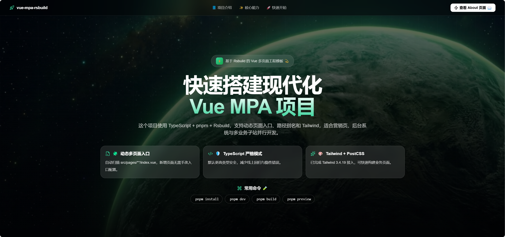

# Rsbuild project mpa




## 项目概述

这是一个基于 Rsbuild 的 Vue 多页面应用(MPA)项目。使用 TypeScript 和 pnpm 作为包管理器,ucide-vue-next作为图标库。

## 核心架构

### 多页面入口机制

项目使用动态入口配置(rsbuild.config.ts:8-15),自动扫描 `src/pages/**/index.{ts,tsx,js,jsx}` 文件作为独立入口点。每个页面文件夹结构:

```
src/pages/
  ├── home/
  │   ├── index.tsx    # 入口文件
  │   ├── App.tsx      # 页面组件
  │   └── App.css
  └── demo/
      ├── index.tsx
      ├── App.tsx
      └── App.css
```

### 关键配置

- **路径别名**: `@/*` 映射到 `src/*` (tsconfig.json:10)
- **资源路径**: `assetPrefix: "./"` 用于相对路径输出
- **开发服务器**: localhost,默认不自动打开浏览器

## 常用命令

```bash
# 安装依赖
pnpm install

# 启动开发服务器 (http://localhost:3000)
pnpm dev

# 生产构建
pnpm build

# 预览生产构建
pnpm preview
```

## 添加新页面

在 `src/pages/` 下创建新文件夹,包含 `index.ts` 作为入口点。Rsbuild 会自动识别并生成独立的 HTML 入口。

## TypeScript 配置

- 严格模式启用
- ESNext 模块系统


## Setup

Install the dependencies:

```bash
pnpm install
```

## Get started

Start the dev server, and the app will be available at [http://localhost:3000](http://localhost:3000).

```bash
pnpm dev
```

Build the app for production:

```bash
pnpm build
```

Preview the production build locally:

```bash
pnpm preview
```


## Tailwind CSS

- 支持 `tailwindcss`，版本：3.4.19 ，已接入 PostCSS。
- 引入方式：在 `src/style/common.css` ,在index.ts/js 引入`import "@/style/common.css"`
